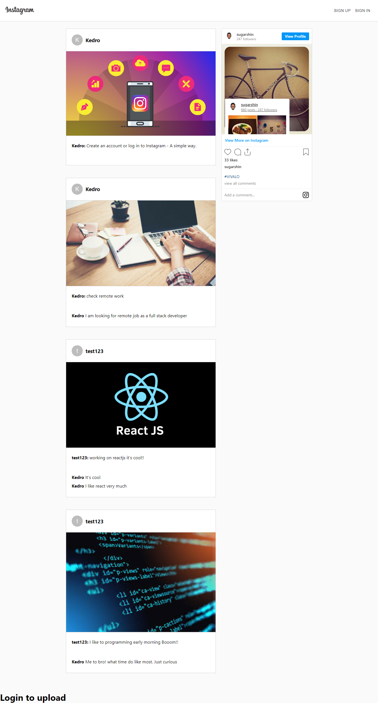

# Instagram Clone
> This project was bootstrapped with [Create React App](https://github.com/facebook/create-react-app). In this project I build an [Instagram](https://instagram.com/) clone.

## Live Demo

[Open Live Demo](https://instagram-react-app-67d58.web.app)

## Built With

- reactjs
- firebase

## 🛠 Setup configurations

To get this app ready to run, follow this steps:

* Clone this repo

        pc:~$ git clone https://github.com/keddo/instagram-clone.git

* Change your directory to the app folder

        pc:~$ cd instagram-clone/

* Install required packages

        pc:~$ npm install
    
## How to use it

Once you have the required packages. 
* Run the following command on your terminal
   > pc$ npm start
## Authors

👤 **Kedir Abdurahman**
- Github: [@keddo](https://github.com/keddo)
- Twitter: [@kedirman](https://twitter.com/kedirman)
- Linkedin: [Kedir Abdurahman](https://linkedin.com/in/kedirabdurahman/)

## 🤝 Contributing

Contributions, issues and feature requests are welcome!

Feel free to check the [issues page](https://github.com/keddo/covid-19-tracker/issues/1).

## 👍 Show your support

Give a ⭐️ if you like this project!

## 📝 License

This project is free to use as learning purposes. For any external content (e.g. logo, images, ...), please contact the proper author and check their license of use.